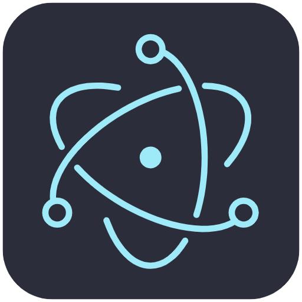

<div align="center">
  
  
  # 🕹️ RetroCaster

  **The Cyberpunk Multi-Platform Video Deployment Pipeline**

  [](https://reactjs.org/)
  [](https://electronjs.org/)
  [](https://www.typescriptlang.org/)
  [](https://tailwindcss.com/)
  [](LICENSE)
</div>

---

## 📖 Обзор (Overview)
**RetroCaster** — это не просто утилита для загрузки видео. Это автоматизированный пайплайн в оболочке олдскульного аркадного автомата. Проект создан для контент-мейкеров, стримеров и авторов, которым необходимо быстро, массово и без лишней рутины раскидывать видеоконтент по разным площадкам (YouTube, VK Video, Telegram, RuTube, Дзен).

Интерфейс пропитан эстетикой киберпанка и 8-битной эры: CRT-сканлайны, неоновое свечение, строгие пиксельные шрифты и элементы геймификации, которые превращают рутинный аплоад видео в увлекательную миссию.

---

## ✨ Ключевые возможности (Features)

*   **🌐 Мульти-Роутинг (Multi-Routing):**
    Умная заливка одного видеоролика сразу на несколько платформ с индивидуальными настройками для каждой.
*   **🎮 Аркадная Геймификация:**
    Система уровней и опыта. Каждая успешная выгрузка приносит XP, повышая ваш ранг от `NOVICE` до `CYBER-LEGEND`.
*   **🛠 Pre-flight Validation (Предполетная проверка):**
    Перед запуском пайплайна система проводит диагностику всех API токенов и доступности платформ.
*   **🎨 Immersive UI:**
    Атмосферный дизайн, созданный с помощью `framer-motion` и TailwindCSS. Эффекты ЭЛТ-монитора, глитчи и пиксельные переходы.
*   **⚙️ Picture-in-Picture Дашборд:**
    Свободная навигация по приложению даже во время активной выгрузки. Дашборд плавно сворачивается в угол экрана.

---

## 🚀 Платформы (Supported Platforms)

| Платформа | Статус Интеграции | Метод |
| :--- | :---: | :--- |
| **YouTube** | 🟢 Активно | YouTube Data API v3 (OAuth 2.0) |
| **VK Video** | 🟢 Активно | VK API (Video, Groups, Wall) |
| **Telegram** | 🟢 Активно | Telegram Bot API |
| **RuTube** | 🟡 В разработке | RuTube Studio API |
| **Дзен** | 🟡 В разработке | Ожидание публичного API |

---

## 📦 Установка и запуск (Installation)

Убедитесь, что у вас установлен [Node.js](https://nodejs.org/) (рекомендуется v18+).

```bash
# 1. Клонируйте репозиторий
git clone https://github.com/Djoystick/Retro_Caster.git

# 2. Перейдите в директорию проекта
cd Retro_Caster

# 3. Установите зависимости
npm install

# 4. Запустите проект в режиме разработки
npm run dev
```

Для сборки готового приложения:
```bash
# Сборка под вашу ОС (Windows/macOS/Linux)
npm run build:win
# или npm run build:mac / npm run build:linux
```

---

## 🗺️ Дорожная карта (Roadmap)
Текущий этап: **Phase 10: System Tray & Background Execution** (В процессе).
Мы активно работаем над возможностью скрывать приложение в системный трей во время длительных загрузок и реализацией нарезки видео (Trimming/Splitting) прямо внутри приложения перед отправкой.

Более подробный план развития можно найти в файле [ROADMAP.md](ROADMAP.md).

---

## 🤝 Контрибьютинг
Pull request-ы горячо приветствуются! Если у вас есть идеи по улучшению интерфейса, добавлению новых платформ или исправлению багов — открывайте Issue.

---

<div align="center">
  <i>"INSERT COIN TO CONTINUE... READY PLAYER 1?"</i>
</div>
